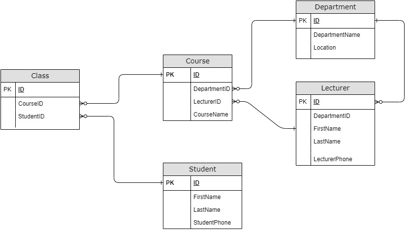
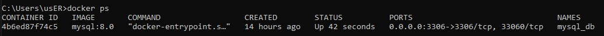
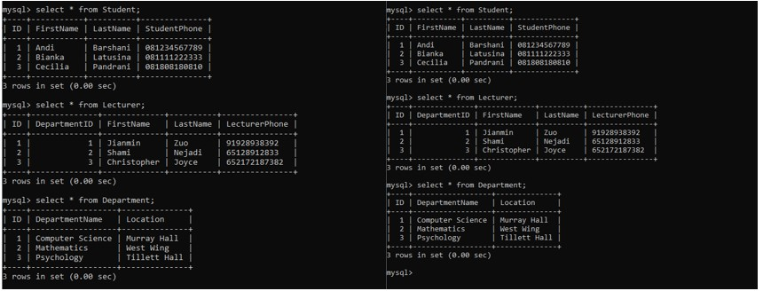
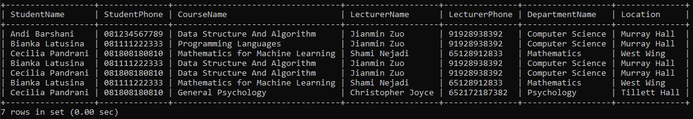

# Database Design using Entity Relationship Diagram (ERD) for University Database System



## What I used in this project: 
- Docker v24.0.5
- Docker Compose v3.8
- App Diagram (https://app.diagrams.net/)


## Steps
#### 1. run docker-compose
```
docker-compose up
```

#### 2. the log will show message that mysql server is ready for connection


#### 3. make sure check docker container is running
```
docker ps
```


#### 4. connect to mysql server using docker bash interactive
```
docker exec -i -t 4b6ed87f74c5 /bin/bash
```

#### 5. connect to mysql server using password defined in env file


#### 6. check if the database and all tables contains data



## simple sql queries for analysis

#### 1. Select All students, Lecturers, and ongoing Class
```SQL
SELECT CONCAT(st.FirstName,' ',st.LastName) StudentName, StudentPhone, CourseName, 
CONCAT(lc.FirstName,' ',lc.LastName) LecturerName, LecturerPhone, DepartmentName, Location
FROM Student st INNER JOIN Class cl ON st.ID = cl.StudentID
INNER JOIN Course co ON cl.CourseID = co.ID
INNER JOIN Lecturer lc ON co.LecturerID = lc.ID
INNER JOIN Department dp ON lc.DepartmentID = dp.ID;
```


#### 2. Select Total Course by Lecturer
```SQL
SELECT CONCAT(lc.FirstName,' ',lc.LastName) LecturerName, COUNT(*) CourseTotal
FROM Lecturer lc
LEFT JOIN Course co ON lc.ID = co.LecturerID
GROUP BY 1 
ORDER BY 2 DESC;
```


#### 3. Select Total Course by Student
```SQL
SELECT CONCAT(st.FirstName,' ',st.LastName) StudentName, COUNT(*) CourseTotal
FROM Student st LEFT JOIN Class cl ON st.ID = cl.StudentID
INNER JOIN Course co ON cl.CourseID = co.ID
GROUP BY 1 
ORDER BY 2 DESC;
```


#### 4. Select Course Name by Total Student and Total Lecturer
```SQL
SELECT CourseName,COUNT(StudentID) StudentTotal, COUNT(LecturerID) LecturerTotal
FROM Course co
LEFT JOIN Class cl ON co.ID = cl.CourseID
LEFT JOIN Student st ON cl.StudentID = st.ID
GROUP BY 1
ORDER BY 2 DESC;
```
